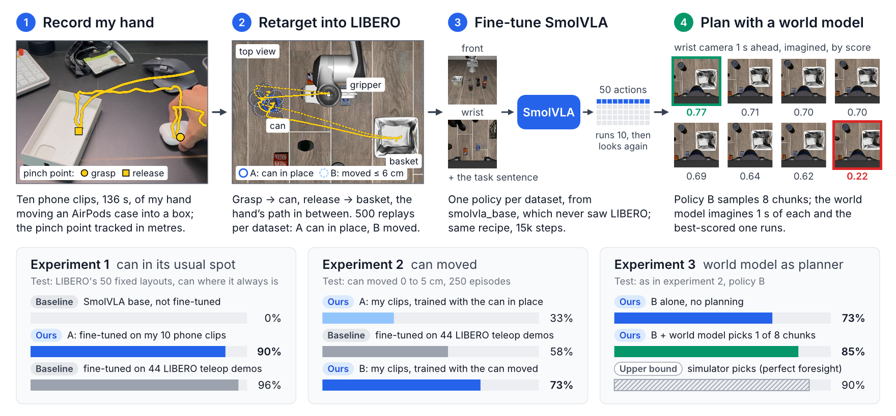
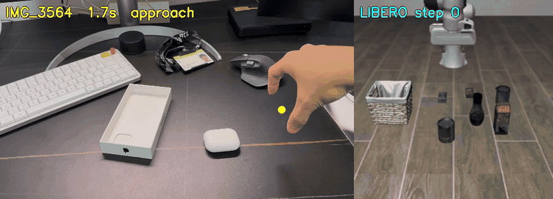
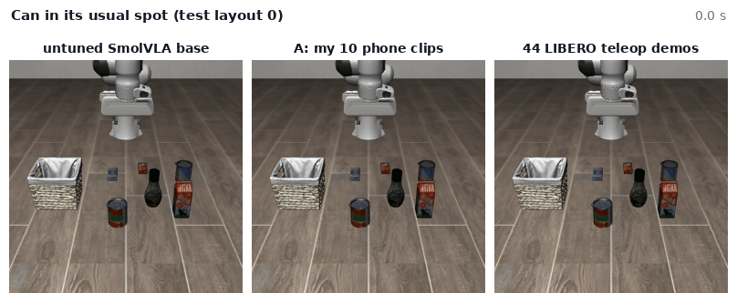
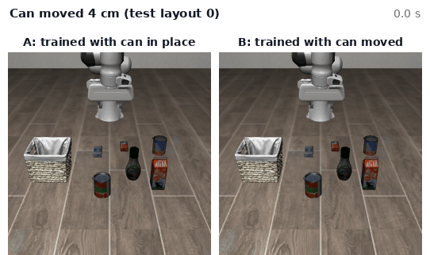
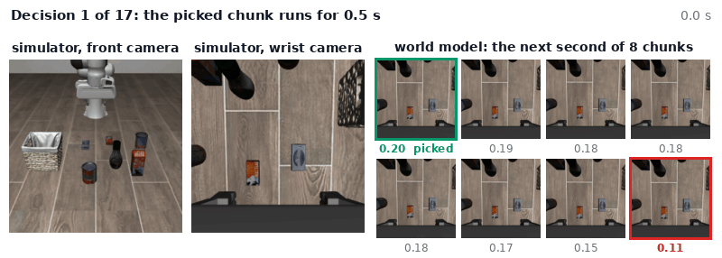
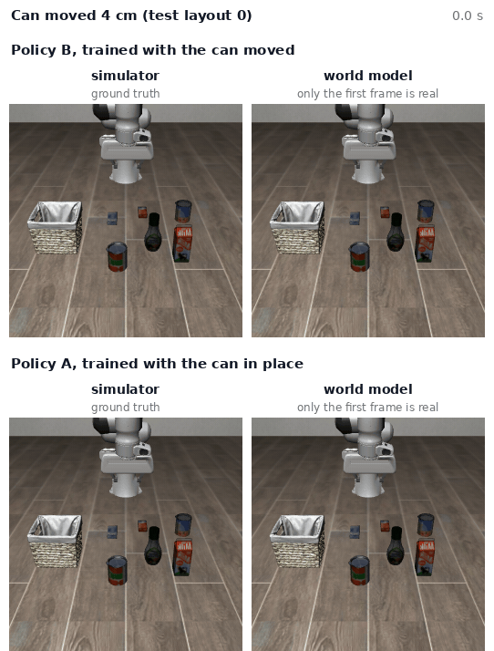
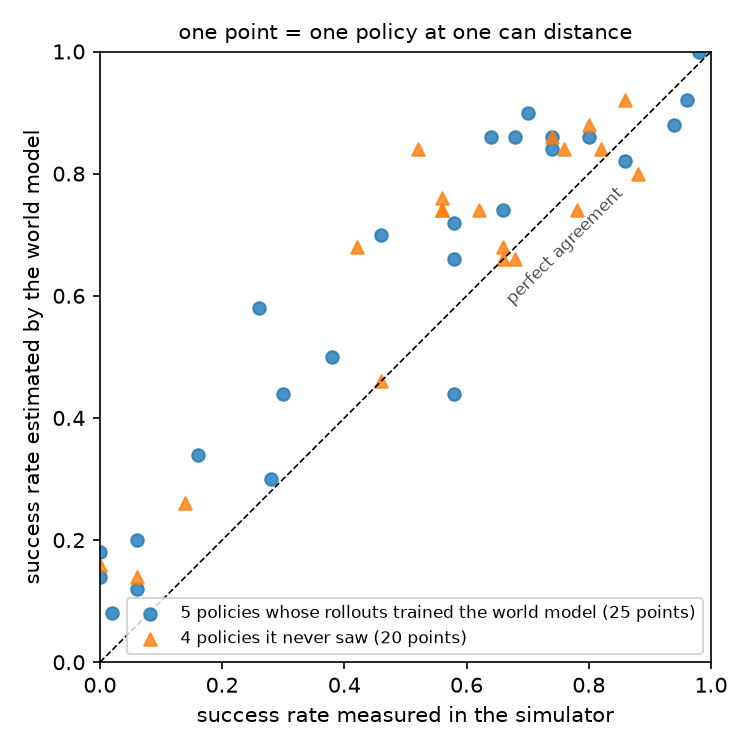

# ego2libero

Ten phone clips of my hand become 500 robot demonstrations for a Franka Panda in [LIBERO](https://libero-project.github.io). They take SmolVLA from 0% to 90% on a task it had never seen, and with the can moved they beat LIBERO's own teleoperated demos (73% against 58%). A world model trained on the episodes then picks the robot's next action chunk (73% to 85%) and scores policies without the simulator (r = 0.94).

[](media/pipeline.pdf)

*The same clips make two datasets: A with the can where LIBERO puts it, B with the can moved up to 6 cm before each replay. One SmolVLA is fine-tuned on each; the world model picks among policy B's chunks.*

## What is new here

- **Ten clips teach a VLA, once the object moves.** Policy A (0% to 90%) learned where the can usually is and fails when it moves (33%). Moving the can during replay gives policy B: 73%, above LIBERO's teleoperated demos (58%). Straight lines through the same grasp and release points reach only 55%, so the hand's path matters, not just its endpoints.
- **A world model that plans and evaluates.** Diffusion over both cameras' VAE latents, with a robot-state model, a success head and a value head. Picking among 8 imagined chunks lifts policy B from 73% to 85% (perfect foresight: 90%). Running whole episodes from one real frame, its success estimates for nine policies track the simulator at r = 0.94.
- **Phone video to robot demo with one box lid and two anchors.** The lid calibrates the camera, so a plain clip gives the hand path in metres. Grasp and release are anchored on the can and the basket, and the task's own success check keeps the replays that work (500 of 500).



*Left, one clip with the tracked pinch point. Right, the same motion retargeted and run in LIBERO.*

## Experiments

LIBERO-Object task 0, "pick up the alphabet soup and place it in the basket". Every policy is fine-tuned from `lerobot/smolvla_base`, which never saw LIBERO, with the same recipe (15k steps), and runs 10 of its 50 predicted actions before looking again. 50 episodes per number. The reference is LIBERO's 44 teleoperated demos of this task.

### Experiment 1: the can in its usual spot

| Fine-tuning data | Success (95% interval) |
|---|---|
| none (`smolvla_base` untuned) | 0% (0-7) |
| A: 500 replays of my ten clips | **90%** (79-96) |
| 50 straight-line episodes through the same grasp and release points | 94% (84-98) |
| 44 teleoperated LIBERO demos | 96% (87-99) |
| `smolvla_libero` (all of LIBERO), not fine-tuned | 94% (84-98) |

136 s of video take a model that never saw this robot from 0% to 90%. On these fixed layouts every data source is near the ceiling, so the next experiment moves the can.



*One test layout: the untuned base model, policy A and the teleop policy.*

### Experiment 2: the can moved

The can is moved 2 to 5 cm from its usual spot (`ego2libero/shift_env.py`). The mean includes 0 cm, a second run of experiment 1.

| Fine-tuning data | 0 cm | 2 cm | 3 cm | 4 cm | 5 cm | mean |
|---|---|---|---|---|---|---|
| A: 500 replays of my clips | 86% | 58% | 16% | 6% | 0% | 33% |
| **B: the same replays with the can moved** | 70% | 74% | 68% | **80%** | **74%** | **73%** |
| 500 straight-line episodes, can moved the same way | 42% | 52% | 56% | 56% | 68% | 55% |
| 44 teleoperated demos | 98% | 64% | 58% | 46% | 26% | 58% |
| `smolvla_libero`, not fine-tuned | 94% | 66% | 58% | 38% | 30% | 57% |

Policy A memorised the can's spot: its 500 training grasps lie within 0.7 cm of one point. Dataset B moves the can before each replay and anchors the grasp on its new position (`replay_libero.py --shift-cm 6`). Policy B beats the teleop demos from 3 cm on, and a second training seed gives the same 183/250.

The hand's path carries the gain. Straight lines moved the same way reach 55% (p < 0.001); my paths at constant speed keep 64%, my timing on straight paths drops to 36%. [Three demos of one scene side by side](media/demo_kinds.mp4).



*Can moved 4 cm. A hovers over the old spot and leaves empty-handed; B goes to the can.*

### Experiment 3: the world model picks the next chunk

The world model predicts the next frame of both cameras from recent frames, actions and robot state, trained on the replays and 1,117 policy rollouts, failures included. At every decision policy B proposes 8 chunks, the world model imagines one second of each from the real history, and a value head picks one. Perfect foresight, the simulator trying each chunk and rewinding, is the ceiling.

| Can moved | Policy alone (two runs) | **World model picks** | Perfect foresight |
|---|---|---|---|
| 0 cm | 70%, 78% | 84% | 96% |
| 2 cm | 74%, 80% | 86% | 90% |
| 3 cm | 68%, 66% | 86% | 94% |
| 4 cm | 80%, 70% | 78% | 82% |
| 5 cm | 74%, 70% | 92% | 88% |
| mean | 73% | **85%** | 90% |

85% against 73% (p = 0.0002), 5 points below perfect foresight. Decision by decision it picks the truly best of the 8 chunks 53% of the time, against 23% by chance.



*Right, the 8 imagined futures at each decision, best first; the picked chunk (green) runs in the simulator for 0.5 s.*

### Experiment 4: whole episodes inside the world model

Here the world model replaces the simulator: a policy gets one real frame, then acts only on imagined frames until the model's success check fires. Over nine policies and five can distances, its success estimates track the simulator at r = 0.94 (0.91 for the four policies it never saw), running 10 points high on average.



*The layout of experiment 2: the simulator, and the world model given only the first frame. B succeeds and A fails in both.*



*One point per policy and can distance. Triangles are policies the world model never saw.*

**When to trust it**, from checks against the simulator run from the same saved states:

| | Trust | Don't trust |
|---|---|---|
| Comparing policies | large gaps (r = 0.94) | close policies (rank correlation about 0.6 at 0 and 2 cm) |
| Look-ahead | picking chunks up to 2 s ahead | whole-episode success rates (10 points high) |
| Gripper | at the grasp | opening mid-carry (49%, a coin flip) |
| Its own confidence | its most confident picks (71% right) | the rest |

## Design choices

- **Retarget onto an existing LIBERO task**, which brings a success check, test layouts and baselines.
- **Start from `smolvla_base`**, so everything the policy learns comes from my data.
- **World model in a pretrained VAE latent space**: both cameras, trained on one GPU in an hour.

## What didn't work at first

- **Replays with the can in its usual spot.** The policy learned a position, not the can (33% with the can moved). Fix: move the can before every replay (73%).
- **A world model trained on successes only.** It imagined the can lifted whether or not the gripper had closed. Fix: failures in its training data.
- **The off-the-shelf VAE.** It shifts the label colours enough that policy B, fed decoded frames, fell from 80% to 58% at 4 cm. Fix: fine-tune only the decoder on LIBERO frames (84%).
- **Fresh normalisation statistics.** Every fine-tuned policy collapsed. Fix: keep SmolVLA's pretrained ones.

Limits: one task, one object, one person, and the simulator is the only ground truth.

## Running it

One GPU (an RTX 5090 here), Linux, `MUJOCO_GL=egl`. The hand trajectories of all ten clips are in the repo, plus one clip for the video steps. Each policy takes about 50 minutes to train and is then scored on the benchmark and with the can moved.

```bash
bash environment/setup_env.sh        # conda env: LeRobot 0.6.1, LIBERO, MediaPipe, diffusers, assets, models
conda activate ego2libero
bash scripts/phone/run_sample.sh     # video steps on the clip in the repo; reproduces its trajectory exactly
bash scripts/make_data.sh            # the four datasets, about 15 min

bash scripts/train_policy.sh ego2libero_human_v3_fixed phone_base                 # policy A
bash scripts/train_policy.sh ego2libero_human_v3_fixed_shift phone_shift_base     # policy B
bash scripts/train_policy.sh ego2libero_scripted_v3 scripted_base                 # straight lines
bash scripts/train_policy.sh ego2libero_scripted_v3_shift scripted_shift_base     # straight lines, can moved
bash scripts/train_policy.sh teleop teleop_base                                   # LIBERO's 44 teleoperated demos
bash scripts/eval_policy.sh lerobot/smolvla_base smolvla_base                     # untuned base
bash scripts/eval_policy.sh HuggingFaceVLA/smolvla_libero smolvla_libero          # LIBERO checkpoint
bash scripts/human_ablation.sh                                                    # constant speed, straight paths
SEED=2000 bash scripts/train_policy.sh ego2libero_human_v3_fixed_shift phone_shift_base_s2000   # second seed

bash scripts/world_model.sh          # about 3 h
bash experiments/more_steps.sh && bash experiments/mixed_data.sh   # held-out policies for experiment 4
bash scripts/world_model_eval.sh     # experiments 3 and 4, about 5 h
```

On your own clips, run `scripts/phone/prepare_videos.py` and `calibrate_from_box.py` first, then the four steps of `run_sample.sh`.
